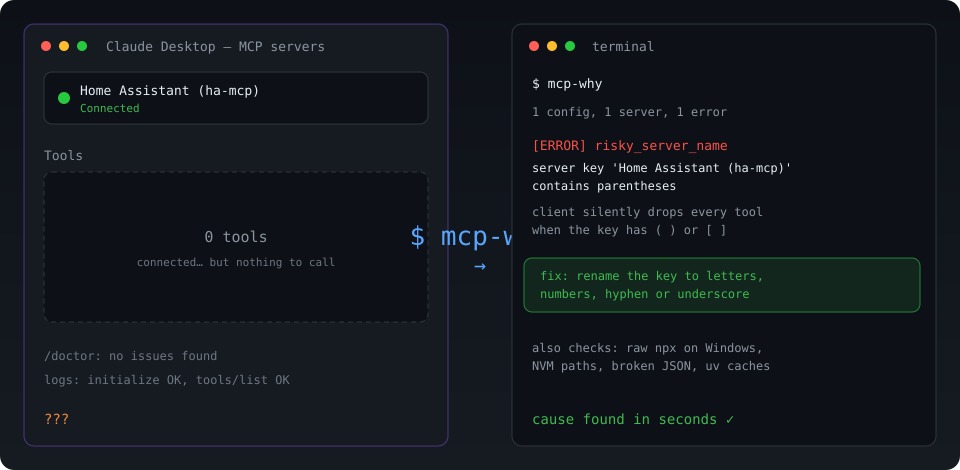

# mcp-why

[](https://github.com/lajiaojiang-ai/mcp-why/actions/workflows/test.yml)
[](LICENSE)

Explain why an MCP server is configured but missing, empty, or silent.



Official inspectors test **servers**. Official `/doctor` often says nothing is wrong. `mcp-why` reads the **client config** and tells you the actual reason the tools never appeared.

## Why this exists

These are public, recurring failures — not hypothetical ones:

- MCP + `npx` on Windows: [modelcontextprotocol/servers#40](https://github.com/modelcontextprotocol/servers/issues/40)
- MCP + NVM: [modelcontextprotocol/servers#64](https://github.com/modelcontextprotocol/servers/issues/64)
- Legal Windows paths rejected: [modelcontextprotocol/servers#447](https://github.com/modelcontextprotocol/servers/issues/447)
- Claude `/doctor` misses MCP config errors: [anthropics/claude-code#64768](https://github.com/anthropics/claude-code/issues/64768)
- Parentheses in a server key silently drop tools: [homeassistant-ai/ha-mcp#1743](https://github.com/homeassistant-ai/ha-mcp/issues/1743)
- Configured servers not showing on Windows: [kirodotdev/Kiro#7927](https://github.com/kirodotdev/Kiro/issues/7927)

This is a community diagnostic. It is **not** an official MCP, Anthropic, or Cursor component.

## Install

```bash
pipx install git+https://github.com/lajiaojiang-ai/mcp-why.git
```

or:

```bash
uv tool install git+https://github.com/lajiaojiang-ai/mcp-why.git
```

## Use

Scan the usual client config locations:

```bash
mcp-why
```

Scan an explicit file:

```bash
mcp-why --config examples/broken-parentheses.json
```

JSON output and markdown report:

```bash
mcp-why --config examples/broken-npx-windows.json --json
mcp-why --config examples/broken-parentheses.json --output report.md
```

Optional live probe — `initialize` and `tools/list` only, never a tool call:

```bash
mcp-why --config path/to/mcp.json --probe
```

## What it checks

- invalid JSON and unescaped Windows paths
- empty / missing `mcpServers`
- server names with `()` `[]` `{}` `<>`
- command not on PATH
- raw `npx`/`npm` on Windows GUI apps
- nvm-managed `npx` that terminals see and Desktop apps do not
- uv/uvx cache risk
- optional stdio probe that counts tools without executing them

It does not install servers, does not become an MCP host, and does not print secret env values.

## Example

```text
[ERROR] risky_server_name: Server 'Home Assistant (ha-mcp)' contains parentheses or brackets
  why: Some clients silently drop every tool when an mcpServers key contains parentheses.
  fix: Rename the key to letters, numbers, hyphen, or underscore only.

[WARNING] windows_npx: Server 'fs' launches npx directly on Windows
  fix: Use {"command":"cmd","args":["/c","npx","-y","..."]}.
```

## Limits

- v0.1 is a local preview. Client config layouts change.
- `--probe` is best-effort and times out; a healthy probe does not prove the GUI will render tools.
- Discovery covers Claude Desktop, Claude Code, Cursor, VS Code, Kiro, and OpenCode common paths. Pass `--config` for anything else.

## License

MIT
